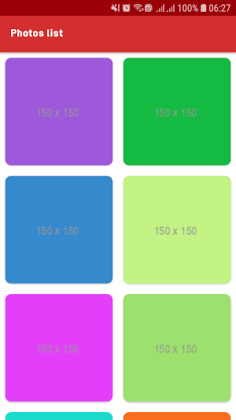

# Test Application for Sheypoor

This app is a simple app, which use from [JSONPlaceholder](https://jsonplaceholder.typicode.com/) API to fetch photos and detail of photo. this app uses the Architecture components, Koin etc in Kotlin.

## Outputs
 
 

## Libraries and tools 🛠
- [Navigation](https://developer.android.com/topic/libraries/architecture/navigation/)   
- [ViewModel](https://developer.android.com/topic/libraries/architecture/viewmodel)   
- [LiveData](https://developer.android.com/topic/libraries/architecture/livedata)   
- [RoomDB](https://developer.android.com/topic/libraries/architecture/room)   
- [Koin](https://github.com/InsertKoinIO/koin)   
- [Kotlin Coroutines](https://github.com/Kotlin/kotlinx.coroutines)   
- [Retrofit](https://square.github.io/retrofit/)   
- [OkHttp](https://github.com/square/okhttp)   
- [Picasso](https://github.com/square/picasso)   
- [Material Design](https://material.io/develop/android/docs/getting-started/)   

## Architecture
The app uses MVVM [Model-View-ViewModel] architecture to have a unidirectional flow of data, separation of concern, testability, and a lot more.

